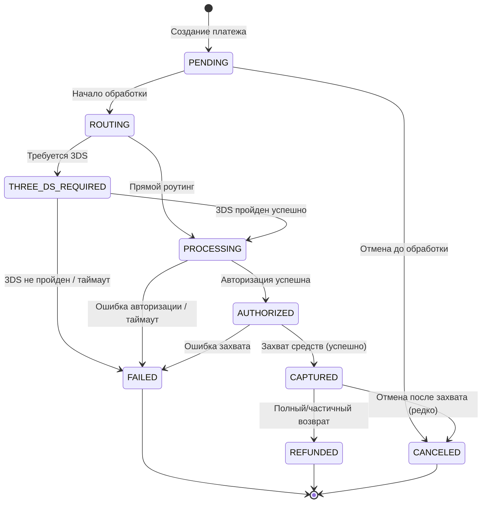

```mermaid
stateDiagram-v2
    [*] --> PENDING : Создание платежа

    PENDING --> ROUTING : Начало обработки
    PENDING --> CANCELED : Отмена до обработки

    ROUTING --> THREE_DS_REQUIRED : Требуется 3DS
    ROUTING --> PROCESSING : Прямой роутинг

    THREE_DS_REQUIRED --> PROCESSING : 3DS пройден успешно
    THREE_DS_REQUIRED --> FAILED : 3DS не пройден / таймаут

    PROCESSING --> AUTHORIZED : Авторизация успешна
    PROCESSING --> FAILED : Ошибка авторизации / таймаут

    AUTHORIZED --> CAPTURED : Захват средств (успешно)
    AUTHORIZED --> FAILED : Ошибка захвата

    CAPTURED --> REFUNDED : Полный/частичный возврат
    CAPTURED --> CANCELED : Отмена после захвата (редко)

    FAILED --> [*]
    REFUNDED --> [*]
    CANCELED --> [*]
```